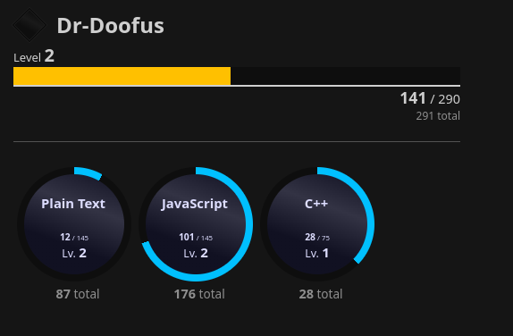

# code-levels README

**NOTE:** The source code was uploaded here by request. As a hobby project, this code **_sucks_**. You have been warned. I am not held liable for any brain damage caused by looking at this.

**NOTE 2 THE SEQUEL:** You may use the issue tracker to ask for support under any of the given labels. I will primarily only fix major bugs that negatively impact the usage experience. I do however have plenty of time to add support for as many languages as possible, though I prefer to remain within the scope of VS Code Marketplace extensions. Please do give me the language identifier (i.e. **code-text-binary**, not just "Binary"), so it skips having to test it.

~

VS Code Levels (aka code-levels or clv) is an extension that counts how many times you've typed in files. It also helps visualizing it using an experience and level system.

Technically, code-levels is a sequel to a previous extension, called vsc-levels.

**NOTE: Opening Code in multiple instances with the <u>same user</u> is <u>NOT</u> compatible, due to them being treated as completely separate instances. I cannot pass information between them, so I can't fix it. I apologize for any inconveniences caused by this. Consider disabling the extension on a workspace scope in one instance to circumvent this.** 

__To minimize the risk of data loss, before closing, save a file on the active instance with the most user progress. Also consider making workspace settings that disable user tracking or disable the extension entirely in that other instance.__

# Features

* A functional leveling system with your keypresses as experience points.
* Optional workspace-specific level tracking.
* Optional per-language level tracking for workspace and user.
* A webview visualizing all your progress in one package.
* Optional special coloring/medal per language at set levels.
* Absurd degree of customization: just about anything is configurable for a strictly personal experience.

# Requirements

* Visual Studio Code 1.73.0.
* Because of its format, only the distributed versions of Code can make use of the VSIX format.

# Installation (VSIX)
* Get the latest VSIX from the releases tab.
* With an open instance of Code, open the Command Palette (`Ctrl+Shift+P`, or `Command+Shift+P` on Mac) and choose `Extensions: Install from VSIX...`. 
* Use the file dialog to point Code to the freshly downloaded VSIX.
* (Optional, but recommended: Open the Settings with `Ctrl+,`, or `Command+,` on Mac, and search for `@ext:drdoofus.code-levels`. Configure the extension to your liking.)

# Commands
This extension contributes the following commands:
* `code-levels.openuserview`: Show the user profile webview. Opens to the side.
_Bound to Ctrl+Alt+5 by default, or Command+Option+5 for Mac._
* `code-levels.openworkspaceview`: Show the workspace profile webview. Opens to the side.
_Bound to Ctrl+Alt+6 by default, or Command+Option+6 for Mac._
* `code-levels.changebar.user`: Change the status bar to show user level. Hides level if user tracking is disabled.  
_Bound to Ctrl+Alt+1 by default, or Command+Option+1 for Mac._
* `code-levels.changebar.workspace`: Change the status bar to show workspace level. Hides level if workspace tracking is disabled.  
_Bound to Ctrl+Alt+2 by default, or Command+Option+2 for Mac._
* `code-levels.changebar.userlang`: Change the status bar to show current language level (for user). Hides level if language tracking is disabled or doesn't show a valid language.  
_Bound to Ctrl+Alt+3 by default, or Command+Option+3 for Mac._
* `code-levels.changebar.workspacelang`: Change the status bar to show current language level (for workspace) level. Hides level if language tracking is disabled or doesn't show a valid language.  
_Bound to Ctrl+Alt+4 by default, or Command+Option+4 for Mac._
* `code-levels.recalculate.user`: Forces a level recalculation on the user. Useful if you want to fix your level in case it looks off (i.e. experience in negatives).
* `code-levels.recalculate.userlang`: Forces a level recalculation on all known languages in the user file. Useful if any language have strange numbers. Otherwise similar to `code-levels.recalculate.user`.
* `code-levels.recalculate.workspace`: Exactly the same as `code-levels.recalculate.user`, but targets the workspace file instead. 
* `code-levels.recalculate.workspacelang`: Exactly the same as `code-levels.recalculate.userlang`, but targets the workspace file instead. 

# Extension Settings
This extension contributes the following settings:  
(This is quite a lot. You have been warned.)

* `code-levels.caps.mainUser`: Limits the display of user level on the tooltip, status bar and webview. Doesn't affect the saved or loaded file, though, so you can safely turn this on and off without losing progress. A given number of 0 or lower means no cap.  
* `code-levels.caps.mainWorkspace`: Same as `code-levels.caps.mainUser` but for the workspace.  
* `code-levels.caps.userLanguage`: Same as `code-levels.caps.mainUser` but for all the user languages.  
* `code-levels.caps.workspaceLanguage`: Same as `code-levels.caps.mainUser` but for all the workspace languages.  
* `code-levels.status.advancedBar`: Replaces the usual Shell-like bar with a more advanced, 8-part alternative. Probably shifts around a lot on Windows machines, so it's off by default. Only useful if `code-levels.status.displayProgress` is on `Bar`.
* `code-levels.status.displayProgress`: Replaces the bar with either nothing, a bar (default) or a percentage.
* `code-levels.status.displayPercentPrecision`: If `code-levels.status.displayProgress` is on `Percentage`, this setting is used to define a set of decimals. The number is the amount of decimals plus one.
* `code-levels.status.displayBarLength`: Allows you to set the length of the experience bar in segments. Any number from `1` to `50` is allowed. If you want the length set to `0`, why not just hide it instead using `code-levels.status.displayProgress`?
* `code-levels.status.displayExperienceType`: Sets whichever experience type the bar should track. Does nothing if the target is not tracked, however. Possible options are `Main User Level`, `Main Workspace Level`, current `User Language Level` and current `Workspace Language Level`.
* `code-levels.status.levelDisplayType`: Allows the user to set how the current level is displayed, if even at all. Also allows it to be set as a percentage next to a bar.
* `code-levels.status.levelPercentPrecision`: Like `code-levels.status.displayPercentPrecision`, this sets the decimal precision of the `Percentage` setting in `code-levels.status.levelDisplayType`.
* `code-levels.status.levelReadySymbol`: Shows a symbol if the bar/percentage is completely full to indicate that the user or workspace is ready to level up their main or language level, depending on whichever bar it tracks.
* `code-levels.status.levelReadySymbolType`: For setting a different symbol next to the level if the bar is full. Used in tandem with `code-levels.status.levelReadySymbol`.
* `code-levels.tooltip.enableTooltip`: Enables the tooltip when hovering over the status item, showing information about the user/workspace at a glance.
* `code-levels.tooltip.enableUser`: Enables or disables the whole user segment of the tooltip `code-levels.tooltip.enableTooltip` offers.
* `code-levels.tooltip.enableUserTotal`: Shows or hides the total experience gained for the user in the tooltip `code-levels.tooltip.enableTooltip` offers. Does nothing if main user level is not tracked.
* `code-levels.tooltip.enableUserLanguage`: Shows or hides a very brief display of progress of the current language stored in the user file. Does nothing if user language level is not tracked.
* `code-levels.tooltip.enableWorkspace`: Exactly the same as `code-levels.tooltip.enableUser` but targets the workspace instead.
* `code-levels.tooltip.enableWorkspaceTotal`: Similar to `code-levels.tooltip.enableUserTotal` but for the workspace file.
* `code-levels.tooltip.enableWorkspaceLanguage`: Similar to `code-levels.tooltip.enableUserLanguage` but for the workspace file instead.
* `code-levels.tooltip.experienceSuffix`: Sets a specific text at the end of the final point value in each line that contains one.
* `code-levels.user.name`: Pick the username. This is seen on the webview as well as used as the location on where the user file saves to. This allows multiple different users on the same machine. **UPON CHANGING THIS, THE EDITOR HAS TO BE RELOADED TO LOAD THE NEW USER FILE PROPERLY! THIS WILL CLOSE ANY DEBUG/RUN SESSIONS.**
* `code-levels.user.tracking`: Enables or disables user file experience gain. The file will still be loaded and saved, but no experience will be given.
* `code-levels.user.trackLanguage`: Enables or disables specific experience gain per language for the user. This is not dependent on `code-levels.user.tracking`.
* `code-levels.workspace.tracking`: Same as `code-levels.user.tracking`, but for the workspace file instead.
* `code-levels.workspace.trackLanguage`: Same as `code-levels.user.trackLanguage`, but for the workspace file instead.
* `code-levels.user.levelMod`: Sets the modifier for the experience formula. Increasing this will make it harder to level up. I recommend it to be double the language experience modifier. **Changing any level mods will force a recalculation of the relevant levels.**
* `code-levels.user.levelModLanguage`: Same as `code-levels.user.levelMod` but for every language instead. 
* `code-levels.workspace.levelMod`: Same as `code-levels.user.levelMod`, but targets the workspace file instead.
* `code-levels.workspace.levelModLanguage`: Same as `code-levels.user.levelModLanguage` but targets the workspace file.
* `code-levels.other.bigNumberFormat`: Changes the suffixes for large numbers, if they are formatted. (i.e. 1k = one thousand, 1M = one million, 1B = one billion, etc.)
* `code-levels.other.barCommandsAffectWorkspaceSettingsInstead`: With this on, any commands that change the bar mode will affect the Workspace settings instead of the user settings.
* `code-levels.views.medalRequirementForUser`: If this value is above 0, a diamond-shaped "medal" appears next to the user name. If the user level passes a multiple of this number (i.e. if this value is 5, 5 or 10 or 15), the medal changes color. Recommended value is 5.
* `code-levels.views.medalRequirementForUserLanguage`: Same as `code-levels.views.medalRequirementForUser` but for each user language instead.
* `code-levels.views.medalRequirementForWorkspace`: Same as `code-levels.views.medalRequirementForUser` but for the workspace/workspace profile instead.
* `code-levels.views.medalRequirementForWorkspaceLanguage`: Same as `code-levels.views.medalRequirementForUserLanguage` but for each workspace language found in the workspace profile.

# Known Issues

* On first usage, it will return an empty bar. Typing anything solves the problem. This also happens when typing in a language that the userfile hasn't recognized yet.  
* Saving can possibly be finicky while editing in multiple instances of Code. Effort has been made to fix this behavior but I cannot guarantee its behavior to be perfectly normal...  
**ESPECIALLY IN MULTIPLE INSTANCES WITH THE SAME USER, I CAN'T VOUCH FOR YOUR USERFILE'S INTEGRITY.**  
* After changing the language mode for a document, I advise saving first so the tracking can continue.
* Editing the settings and/or running some commands also gives you free points because they seem to make changes to documents. It's much heavier on the process itself than simply holding down a button, so I don't feel the urgent need to fix that as there's a more exploitable alternative. Remember, the only person you're ruining the experience for is yourself should you choose to exploit it anyway.  
* After using one of the commands to change the progress bar type to a language mode, it will show full experience & no level until you type. This is to prevent the settings menu to show a language that doesn't exist. Running the command twice also works to fix itself.  
* When using the tooltip to glance at a language ready to level up, it will stay at 99% to prevent taking up too much space (some languages are LONG.). One would probably not obsessively look at it and should prefer to use the webview instead for that.  
* Showing too much in the tooltip causes the scrollbar to appear. That's a VS Code thing... I can't fix that without literally styling it myself, and that's too much effort for a thing that should update a LOT.  

# Release Notes

## 1.0.0-test1
Initial release. Rebuilding the foundation of the codebase does allow for a full rerun of features - thus making the end product more customizable.

These features are inherited from the old version:
* A status bar item that shows current progress to next level, whether it'd be for the user, workspace, or the currently active language in both cases.
* Saving and loading to and from the user data.
* Earning experience with each edit.
* Support to store a lot of languages.
* Commands to switch experience bar mode.
* A copious amount of configuration options, including but not limited to level display, tooltip contents, and even on/off switches for tracking experience for each feature.
* Formatting large numbers for readability & to save space.

These features are new or built upon:
* The ability to manipulate the experience formula yourself, and automatically restore level progress on change.
* The ability to enable/disable user tooltip contents.
* Automatically detecting the language, and condensing "excessive" languages to their parent counterparts (i.e. jsonc > json)
* JSON is actually a language now.
* Beautifies existing language names (i.e. Html > HTML, latex > LaTeX),
* Large number formatting now also has multiple settings.

## 1.0.0-test2 + 1.0.0
* Enabled profile pages for user and workspace. Hotkeys & clicking on the status bar work to open it, too.
* Hard-trims saved user files to 32 characters to prevent save errors.
* Fixed number notation setting swap.
* Number notation now also works for negative numbers (in case you manage to).
* Fixed user language status not working.
* Added new config options related to the webview, as medals are now enabled.
* Webview now updates on configuration change, save and active editor change.

## 1.0.1
* Fixed Workspace language tracking webview showing incorrect information.
* Showed "vanilla Markdown" being shown incorrectly.

## 1.0.2
* Made it so that it only saves when either user tracking settings are enabled. This alleviates some risks of overwriting the data.  
__To minimize the risk of data loss, before closing, save a file on the active instance with the most user progress. Also consider making workspace settings that disable user tracking or disable the extension entirely in that other instance.__

## 1.0.3
* Fixed uncaught exceptions while saving.

## 1.0.4
* Fixed a few unnecessary requires.
* Divides all experience requirements by 5.

## 1.1.0
* Published to GitHub.
* Added convert from go.mod => go.
* Added config option to replace text at the end of tooltip point values.

## 1.1.1
* Documentation hotfix.

# Credits
**DrDoofus**: Programming the extension in its entirety.  
**Plasmawario**: Testing the extension in its early phase.  
**Artum**: Credited for absolutely no reason.